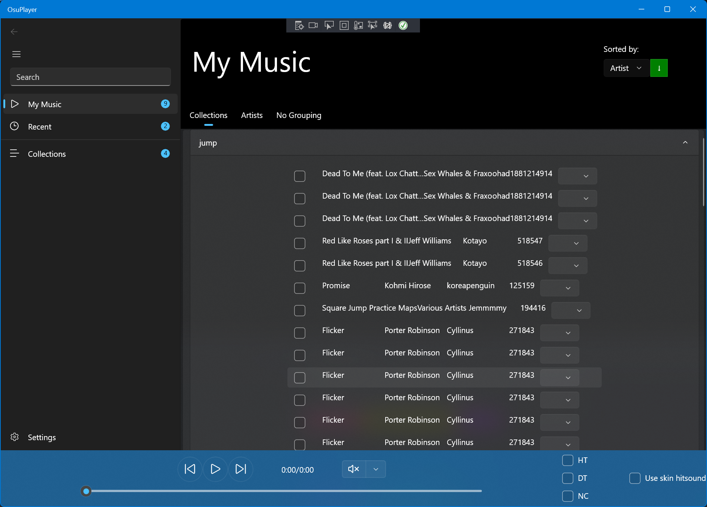

# osu! Player
A UWP app that plays your osu! beatmaps with hitsounds to satisfy your osu! addiction.

## Build
This is a UWP project written in C++/WinRT. 

### Requirements
- [Visual Studio 2019 or 2022 with C++ workload](https://visualstudio.microsoft.com/vs/)
- [C++/WinRT extension](https://marketplace.visualstudio.com/items?itemName=CppWinRTTeam.cppwinrt101804264)

## Code structure
This project tries stricly follows MVVM pattern. 
Source code are named in "namespaced module" styles, i.e 
- `Model.<Model Name>` for models
- `ViewModel.<ViewModel Name>` for ViewModels
- `Page.<Page Name>` for pages
- `Controls.<Control Name>` for controls such as song items, artist items and such 
Those "namespaced" files are under their respective filters in Visual Studio, but due to how filter works, 
you don't see such organizations when you don't open the project in Visual Studio.

## Supported Environment
- Windows 10 19041 or higher (including Windows 11)
- x86/x64/ARM/ARM64

## Current Development Progress
- [x] Add your osu! path, then give it some time to index your beatmaps
- [x] Song lists
- [x] Property page
- [ ] Sort
- [ ] View collections
- [ ] View Singers
- [ ] IRC

MainPage:

Settings:

Collections:

Currently I am limited by the unresolved WinUI related bugs:
- [CollectionViewSource ItemsPath binding not working with public fields](https://github.com/microsoft/microsoft-ui-xaml/issues/6619)
- [Same control property name and binding name cause function template has already been defined compile error](https://github.com/microsoft/microsoft-ui-xaml/issues/7313)
- [Renaming xaml file breaks everything in C++/WinRT](https://github.com/microsoft/microsoft-ui-xaml/issues/7365)
- [Setting FlyoutPlacementMode to Auto crash](https://github.com/microsoft/microsoft-ui-xaml/issues/7384)

Microsoft please FIX!